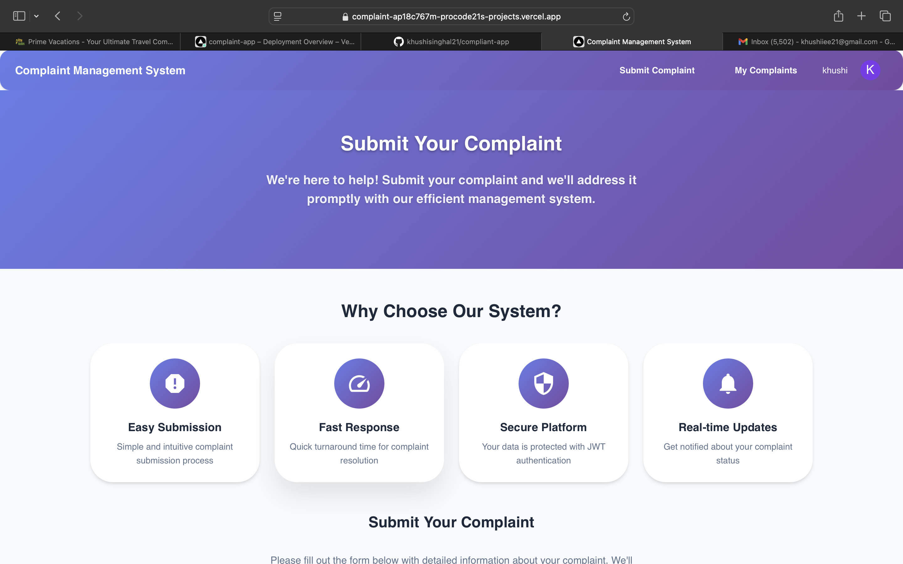

# Complaint Management System

A modern web application for managing and tracking complaints, built with Next.js, React, Material-UI, MongoDB, and JWT authentication.

## 🌐 Live Demo

**Deployed Application:** [https://complaint-ap18c767m-procode21s-projects.vercel.app](https://complaint-ap18c767m-procode21s-projects.vercel.app)

## 📸 Screenshots

### Homepage - Complaint Submission


### User Dashboard - Personal Complaint History


### Admin Dashboard - Complaint Management


### Authentication Page


### Mobile Responsive Design


## Features

### Authentication & Security
- **JWT Authentication**: Secure login/register with access and refresh tokens
- **Role-Based Access**: User and Admin roles with different permissions
- **Protected Routes**: Authentication required for complaint operations
- **Token Management**: Automatic refresh with Redis fallback

### Complaint Management
- **User Interface**: Submit complaints with file attachments
- **User Dashboard**: View and track your own submitted complaints
- **Admin Dashboard**: Manage and track all complaints from all users
- **File Upload**: Drag & drop interface with validation (images, PDFs, documents)
- **Status Tracking**: Pending, In Progress, Resolved statuses
- **Email Notifications**: Admin notifications for new complaints and status updates
- **Complaint History**: Users can view their complaint history and status updates
- **Filtering & Search**: Filter complaints by status, priority, and date
- **Real-time Updates**: Instant status updates and notifications

###  Technical Features
- **Modern UI**: Material-UI with responsive design
- **Real-time Updates**: Instant feedback and data synchronization
- **File Processing**: Image optimization and thumbnails
- **Form Validation**: Client-side and server-side validation
- **Database**: MongoDB with Mongoose schemas

## Tech Stack

- **Frontend**: Next.js 15, React 19, TypeScript
- **UI Framework**: Material-UI (MUI) v5
- **Backend**: Next.js API Routes
- **Database**: MongoDB with Mongoose
- **Cache**: Redis for token management (with in-memory fallback)
- **Authentication**: JWT with bcryptjs
- **Email**: Nodemailer
- **Deployment**: Vercel

## Quick Start

### Prerequisites
- Node.js 18+ 
- MongoDB database
- Redis server (optional - uses in-memory fallback)

### Installation

1. **Clone and install**
   ```bash
   git clone <repository-url>
   cd internship
   npm install
   ```

2. **Environment setup**
   Create `.env.local`:
   ```env
   MONGODB_URI=mongodb://localhost:27017/complaint-system
   JWT_SECRET=your-super-secret-jwt-key
   SMTP_HOST=smtp.gmail.com
   SMTP_PORT=587
   SMTP_USER=your-email@gmail.com
   SMTP_PASS=your-app-password
   ADMIN_EMAIL=admin@example.com
   ```

3. **Run development server**
   ```bash
   npm run dev
   ```

4. **Open browser**
   Navigate to [http://localhost:3000](http://localhost:3000)

## API Endpoints

- `POST /api/auth/register` - User registration
- `POST /api/auth/login` - User login
- `POST /api/upload` - File upload (authenticated)
- `POST /api/complaints` - Create complaints (authenticated)
- `GET /api/complaints` - Get all complaints (admin) or user's own complaints (user)
- `GET /api/complaints/[id]` - Get specific complaint details
- `PUT /api/complaints/[id]` - Update complaint (admin)
- `DELETE /api/complaints/[id]` - Delete complaint (admin)

## Project Structure

```
src/
├── app/                    # Next.js app router
│   ├── page.tsx           # Home page (complaint submission)
│   ├── auth/page.tsx      # Authentication page
│   ├── dashboard/page.tsx # User dashboard (view own complaints)
│   ├── admin/page.tsx     # Admin dashboard (manage all complaints)
│   └── api/               # API routes
├── components/            # React components
├── contexts/              # React contexts
├── lib/                   # Utility functions
└── models/                # Database schemas
```

## User Dashboard Features

- **Personal Complaint History**: View all complaints submitted by the user
- **Status Tracking**: Real-time status updates (Pending, In Progress, Resolved)
- **Filtering Options**: Filter by status, priority, and date range
- **Complaint Details**: View full complaint information including attachments
- **Statistics**: Overview of complaint statistics and trends
- **Responsive Design**: Works seamlessly on mobile and desktop devices

## Deployment

The application is deployed on Vercel with:
- **File upload simulation** for Vercel's serverless environment
- **In-memory Redis fallback** when Redis is not available
- **Environment variables** configured for production

For production file storage, implement cloud storage (AWS S3, Cloudinary, etc.).

## Contributing

1. Fork the repository
2. Create a feature branch
3. Make your changes
4. Submit a pull request

## License

This project is open source and available under the [MIT License](LICENSE).
